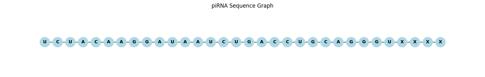

<h1 align="center">🧬 Unsupervised piRNA Generation Using Graph Neural Networks</h1>

## 📌 Description

This project explores an unsupervised learning framework for modeling and generating piRNA sequences using Graph Neural Networks (GNNs). It treats piRNA sequences as linear graphs where each nucleotide is a node and edges represent the backbone connectivity. The ultimate goal is to enable **graph-based generation of valid and diverse piRNA sequences**.

---

## ✅ What’s Done So Far

- ✔️ **Raw Dataset Loading & Preprocessing**: Loaded a public RNA dataset and filtered piRNA entries with lengths between 26–32 nucleotides.
- ✔️ **One-Hot Encoding**: Converted each nucleotide into a one-hot encoding vector (`[A, C, G, U, X]`), padded to fixed length of 32.
- ✔️ **Graph Construction**: Represented each piRNA sequence as a directed linear graph of 32 nodes and bidirectional edges.
- ✔️ **PyTorch Geometric Dataset Class**: Created a custom `InMemoryDataset` to efficiently store and retrieve graph data.
- ✔️ **Dataset Stats Logging**: Summary of dataset composition and piRNA filtering statistics are printed for verification.
- ✔️ **Sample Graph Visualization**: One of the sequence graphs is plotted using NetworkX + Matplotlib.

---

## 🧪 What’s Next

- 🧠 Implement a **GraphGAN** for unsupervised piRNA generation.
- 🔍 Explore **sequence validity** and **biological interpretability** of generated graphs.
- 🧬 Evaluate generated sequences for properties like length, diversity, and nucleotide distribution.
- 📈 Compare with baseline sequence models (e.g., RNN-based generation).

---

## 🖼️ Example Graph Output

Each piRNA sequence is represented as a graph of 32 nodes, with one-hot node features and bidirectional edges connecting consecutive nucleotides.

  

---

## 🧠 Inspiration

This project is inspired by the concepts presented in:

> **RNAGAN: Graph-Aware Generative Models for Structured RNA Generation**  
> [Link to paper](https://www.biorxiv.org/content/10.1101/2023.07.11.548246v2)

---

<i>More coming soon – this repository is actively being developed!</i>

